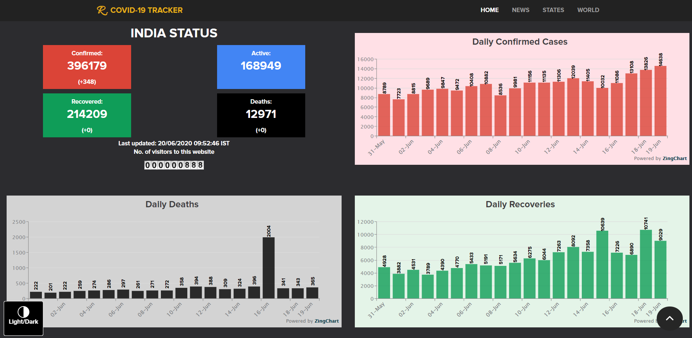

# COVID 19 Live Tracker 

Visit the website at <a href="https://covid-live-track.herokuapp.com/">COVID Live Tracker</a>.

This website shows live status of the coronavirus count.  
There is a dropdown selection menu for selecting States of India. When the name of the state is selected, live status of the state is displayed. There is also a country search bar which when entered the country name, gives the live status of that country as well. These values are updated in real time. 

This website is made mobile-friendly.

<h3>Home Page</h3>

    
    

<h3>News Page</h3>

    

<h3>Indian States</h3>

    

<h3>World Status</h3>

    

# All New Dark Mode 

<!-- 

    
    
    

 -->
