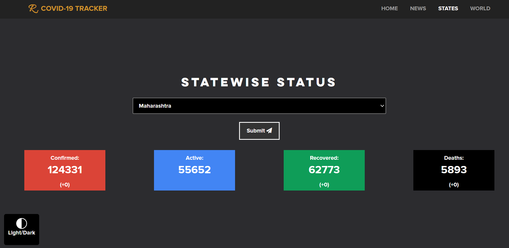
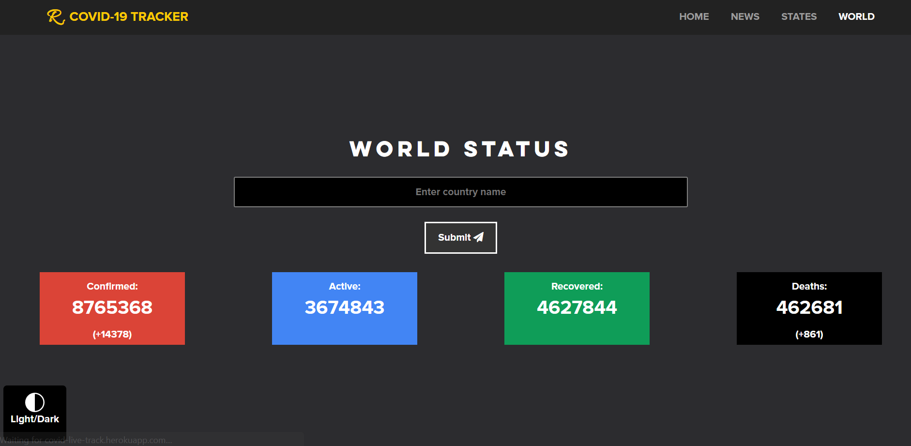

# COVID 19 Live Tracker 

Visit the website at <a href="https://covid-live-track.herokuapp.com/">COVID Live Tracker</a>.

<i>Monitoring one of the most essential thing in today's world i.e. COVID-19 made easy.</i>

Daily confirmed cases, daily deaths and daily recoveries are monitored and displayed using graphic visualizations. The news page has the official twitter handle <a href="https://twitter.com/COVIDNewsByMIB">COVIDNewsByMIB</a>.
Feedbacks can be provided via mail using the button in the footer of the main page. 

This website is supported on various devices including iPads, iOS/Android devices, Tablets, Huge screen monitors, Laptops, Desktops etc.

<h3>Home Page</h3>

    
    

<h3>News Page</h3>

    

<h3>Indian States</h3>

    

<h3>World Status</h3>

    

## Dark Mode 

Bringing the dark mode to this website boosts its readability in dark environment. Everything is rendered to adjust with the dark background.

    
    
    

